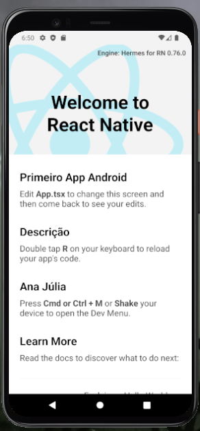

# Teste Android

    

 

Precisei fazer um teste pra ver se todas as funções do react e do android studio estavam funcionando para desenvolver um projeto futuro chamado Cardápio Online e aqui está o resultado:

## Demonstração

## License

